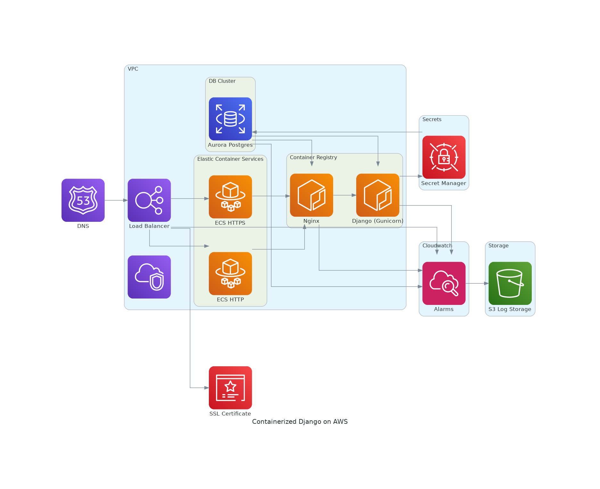

# Infrastructure as Code for Deploying Django to AWS using Terraform/ECS/Fargate
 

       

There are lots of tutorials out there on how to Dockerize and deploy Django to AWS. There are none that I could find that work with Terraform and that provide you with SSL, load balancing, and a managed database, all in a serverless setup.

This project plugs that gap. It demonstrates and documents how you need to setup your containers. And it has terraform provisioning to start this all on ECS Fargate. I also provide a helper script that will get your Docker images built and give you shell access to running containers.

A note: this is really all a *LOT* harder than it should be. My hope is that you can learn from my pain.

## Outline of What This Does

There's more to it than that as we have to setup security groups etc. But this is the gist.

## Prerequisites

You need a Route 53 domain/hosted zone and an ACM SSL certificate. The setup I use to generate that is in my [eve.gd repository](https://github.com/MartinPaulEve/meve-iac).

# terraform.tfvars
The variables that you pass in to this module are how you confgure the setup.

Here is sample from the repo:

    ssl_certificate_arn = "arn:aws:acm:us-east-1:747101050174:certificate/0816d2e4-1c07-44e0-99e0-55763e24615e"
    hosted_zone_id = "Z04028672340GRJRXW460"
    hosted_zone_arn = "arn:aws:route53:::hostedzone/Z04028672340GRJRXW460"
    
    container_image = ""
    hostname = "staging.eve.gd"
    default_certificate_arn = "arn:aws:acm:us-east-1:747101050174:certificate/0816d2e4-1c07-44e0-99e0-55763e24615e"
    container_name = "django_nginx"
    name_prefix = "martinpauleve-test"
    log_configuration = {"logDriver"="awslogs", "options"={"awslogs-region"="us-east-1", "awslogs-group" = "container-log", "awslogs-stream-prefix"="djangotest"}}
    port_mappings = [
      {
        "containerPort": 80,
        "hostPort": 80,
        "protocol": "tcp"
      },
      {
        "containerPort": 443,
        "hostPort": 443,
        "protocol": "tcp"
      }
    ]
    enable_execute_command = true
    secret_name = "martinpauleve-secrets"
    
    lb_https_ports = {
      default_http = {
        type                  = "forward",
        listener_port         = 443,
        target_group_port     = 443,
        target_group_protocol = "HTTP"
      }
    }
    database_user = "martin"
    database_name = "newtest"

Some comments on this:

* ssl_certificate_arn is the SSL certificate you are using
* hosted_zone_id is the Route54 domain ID
* hosted_zone_arn is the Route54 domain ARN
* container_image is/should can be blank ( I may fix this later)
* hostname is your domain name
* default_certificate_arn is the certificate ARN, as above (again, I may de-duplicate this later)
* container_name is the main container to start
* name_prefix is just a nice prefix to add to all objects so you can identify them
* log_configuration sets up the logging so that you can see what's going on
* port_mappings specifies the external listeners
* enable_execute_command allows you to say whether you want to connect using aws ecs execute-command, which helps with debugging containers
* secret_name is the name of the secret store for the DB username and password
* lb_https_ports lets you configure the HTTPS ports in the system
* database_user is the master database username
* database_name is, unsurprisingly, the database name

## Deploying

1. Ensure, in AWS/main.tf and AWS-ECR/main.tf that the region is set correctly as you want it. You should set the same region in your ~/.aws/config file.
2. Create an Elastic Container Registry to hold your images. This has to be done as a separate first step:

    cd AWS-ECR
    terraform init
    terraform apply

Note down the output from this command, which will look something like this:

    terraform_registry_arn = "arn:aws:ecr:eu-west-2:747101050174:repository/staging"
    terraform_registry_url = "747101050174.dkr.ecr.eu-west-2.amazonaws.com/staging"

3. Edit the Dockerfile in the root to change all references to "djangoTest" to reflect your actual project setup.
4. Grab a Docker login token:

    python3 -m shell docker-login

This is a helper utility that I have written that runs the aws CLI command in the background.

5. Edit docker/build.sh to change the DOCKER_REGISTRY value to your registry with your account number and your region. You can do this using the helper script:

    
    python3 -m shell update-build

6. Build and push your docker image:

    ./build.sh

7. Provision the infrastructure!

    cd AWS
    terraform init
    terraform apply

8. Wait a few minutes for this all to apply.

9. Shell into your container. You can either do this by looking up the service and its task ID or by using my provided python script:

    python -m shell shell-app

If you get an error "An error occurred (InvalidParameterException) when calling the ExecuteCommand operation" then you need to wait a bit longer while the service starts. If this persists for too long, there may be a problem with the container. You can also test with python -m shell nginx, which will drop you into the nginx (as opposed to gunicorn) container. 

10. Run your migrations:

    python ./manage.py migrate

11. Visit your domain. Tada!

## Debugging
Check the containers are running:

* Visit https://us-east-1.console.aws.amazon.com/ecs/home?region=us-east-1#/clusters (change the region to your region)
* Click the cluster name
* Under the "services" tab, click the service name
* Under the "tasks" tab, check Running or Stopped tasks for their status

If there are database problems:

* Shell into the gunicorn container, as above (python -m shell shell-app)
* Run "printenv" and check that the DB credentials are displayed
* Check you can access the postgresql install:

    apt update
    apt install postgresql-client
    pg_isready --host YOUR_DB_HOST.rds.amazonaws.com --dbname=YOURDBNAME --port=5432

## Gotchas
* ECS/Fargate uses the Dockerfile for its task execution, NOT the "command" in any docker-compose.yml. That is, you cannot put a command in your docker-compose.yml and expect the container to run. It will simply return with exit code 0. (But it won't tell you that and your local tests with "docker-compose up" will seem to run just fine.) Instead, you should end your Dockerfile with a CMD that calls your process.
* SSL termination at the load balancer is broken in the remote cn-terraform/terraform-aws-ecs-alb (load balancer). It doesn't allow you to specify that an HTTPS listener should, internally, fetch from an *HTTP* endpoint in Nginx. I have [commented on the issue in question](https://github.com/cn-terraform/terraform-aws-ecs-fargate-service/issues/23).
* If you specify your "aws_secretsmanager_secret_version" as a JSON string and put a trailing comma on it, Terraform will break when you next try to do anything (even destroy operations). It is safer, therefore, to pass a well-formed map to jsonencode instead, which is what we do in secrets-manager.tf.
* If you are struggling to get shell access to your container, make sure you have installed the [Session Manager Plugin](https://docs.aws.amazon.com/systems-manager/latest/userguide/session-manager-working-with-install-plugin.html) locally. You need this before you can get access.
* Your postgres/aurora master password should not contain special characters or you will not be able to login using password auth. Who designed this thing? I also couldn't get this to work when I passed a password, rather than letting the system auto-generate it.
* If you destroy and then recreate this infrastructure, you will need to specify a new name for the secret ('secret_name') as AWS won't let you re-use these within a certain grace period.

## The shell helper script

The shell.py helper script is designed to help you debug and/or interact with the containers setup by this project.

    Usage: python -m shell [OPTIONS] COMMAND [ARGS]...
    
      Interact with the container install
    
    Options:
      --help  Show this message and exit.
    
    Commands:
      docker-login      Get a login token from AWS ECR
      generate-diagram  Draw the infrastructure diagram
      get-aws-id        Get the AWS ID for the current user
      get-prefix        Get the prefix for this install
      get-region        Get the region we're in
      get-task          Get the task ID for our service
      shell-app         Drop to a shell on the gunicorn container
      shell-nginx       Drop to a shell on the nginx container
      update-build      Update the build file with the Docker registry

# Credits
* [AWS CLI](https://aws.amazon.com/cli/) for interactions with AWS.
* [Click](https://click.palletsprojects.com/en/8.0.x/) for CLI argument parsing.
* [cn-terraform/terraform-aws-ecs-alb](https://github.com/cn-terraform/terraform-aws-ecs-alb) here forked to allow internal HTTP routing rather HTTPS
* [cn-terraform/terraform-aws-ecs-fargate-service](https://github.com/cn-terraform/terraform-aws-ecs-fargate-service) here forked to allow internal HTTP routing rather HTTPS
* [Django](https://www.djangoproject.com/) for the ORM and caching system.
* [Git](https://git-scm.com/) from Linus Torvalds _et al_.
* [.gitignore](https://github.com/github/gitignore) from Github.
* [Interactive shell runner](https://stackoverflow.com/a/53312631/349003) courtesy of Shawn on Stack Overflow
* [Rich](https://github.com/Textualize/rich) for beautiful output.
* [Terraform](https://www.terraform.io/) by Hashicorp.
